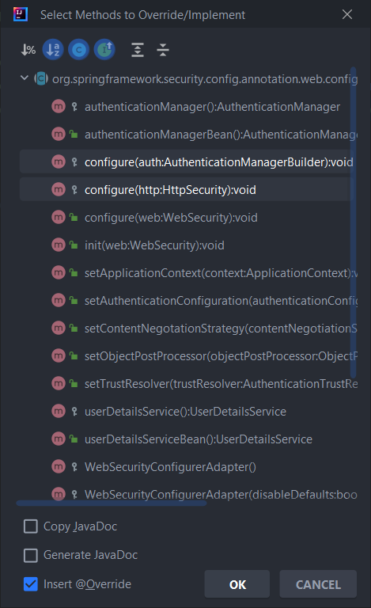
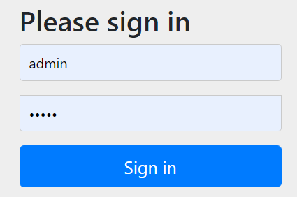
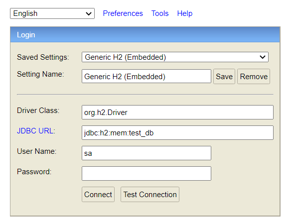
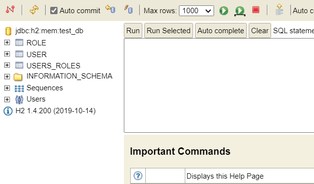
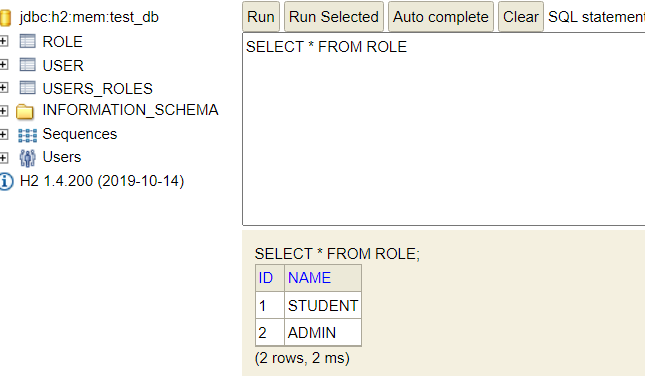
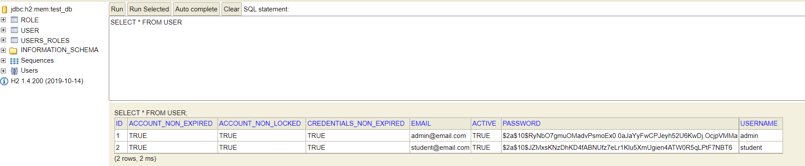
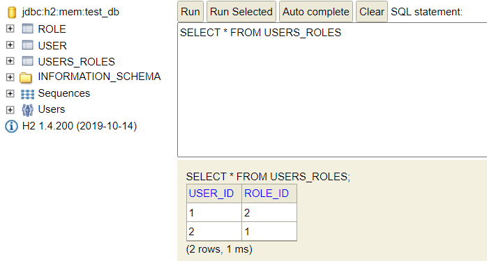
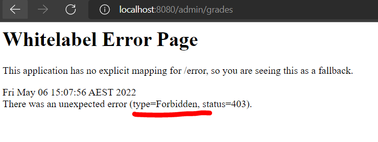

# Spring Security Example

Hi 👋 ... This project is an example to show the typical use case and power of [Spring Security](https://spring.io/projects/spring-security)

<div align="center">
<blockquote>
<i>
Spring Security is a powerful and highly customizable authentication and access-control framework. It is the de-facto standard for securing Spring-based applications.

Spring Security is a framework that focuses on providing both authentication and authorization to Java applications. Like all Spring projects, the real power of Spring Security is found in how easily it can be extended to meet custom requirements
</i>
<p align="right">
<a href="https://spring.io/projects/spring-security">spring.io</a>
</p>
</blockquote>
</div>

You are welcome to clone/fork this project and modify it to suit your needs, but below I explain each step of the way to create this project for yourself, so if you're keen to work through it and hopefully learn a thing or two then get yourself an empty project and read on... 

To get going you will need a spring boot application with the following dependencies:<br/>
_If you don't have one you can generate an empty project at_ https://start.spring.io/
```xml
<dependency>
    <groupId>org.springframework.boot</groupId>
    <artifactId>spring-boot-starter-data-jpa</artifactId>
</dependency>
<dependency>
    <groupId>org.springframework.boot</groupId>
    <artifactId>spring-boot-starter-web</artifactId>
</dependency>
<dependency>
    <groupId>org.springframework.boot</groupId>
    <artifactId>spring-boot-starter-security</artifactId>
</dependency>
<dependency>
    <groupId>org.springframework.security</groupId>
    <artifactId>spring-security-test</artifactId>
    <scope>test</scope>
</dependency>
<dependency>
    <groupId>com.h2database</groupId>
    <artifactId>h2</artifactId>
    <scope>runtime</scope>
</dependency>
<dependency>
    <groupId>org.projectlombok</groupId>
    <artifactId>lombok</artifactId>
    <optional>true</optional>
</dependency>
<dependency>
    <groupId>org.springframework.boot</groupId>
    <artifactId>spring-boot-starter-test</artifactId>
    <scope>test</scope>
</dependency>
```

To get started we will create some directories in the `com.example.spring_security_example` package
1. configuration
2. controller
3. security
4. repository
5. model

Create a config file in the [configuration](src/main/java/com/example/spring_security_example/configuration) folder, in this example I'll name it `SpringSecurityConfig.java`

In [SpringSecurityConfig](src/main/java/com/example/spring_security_example/configuration/SpringSecurityConfig.java) we need to annotate the class with the following two annotations so spring boot will know to use it to configure our spring security. We also need to make our class extend the `WebSecurityConfigurerAdapter` class like below.

 ```java
@Configuration
 @EnableWebSecurity
 public class SpringSecurityConfig extends WebSecurityConfigurerAdapter
```

In our [config](src/main/java/com/example/spring_security_example/configuration/SpringSecurityConfig.java) class, we now need to override 2 super class methods. You can do this manually, but NetBeans and IntelliJ both have shortcuts if you press the `alt + insert` keys and select **Override** as shown here, ee need 2 out of the 3 **configure** methods (not the web security one).

 

We also need to include an **encodePassword** method which we will need so that we don't store any passwords in plain text.

 ```java
 @Bean
 public BCryptPasswordEncoder encodePassword() {
     return new BCryptPasswordEncoder();
 }
 ```
Before we go any further, we need to create some other classes.
  First, create a `User` & `Role` class in the **model** folder. Since we're using **lombok** we can save ourselves a bit of writing, but we need our `Role` class to look like the following
 *Note:* It won't recognize the `User` class, but we'll fix that up straight after this.

  ```java
  @Getter
  @Setter
  @NoArgsConstructor
  @AllArgsConstructor
  @Entity
  @Table(name = "role")
  public class Role {

      @Id
      @GeneratedValue
      @Column(name = "id", nullable = false)
      private Long roleId;

      @Column(name = "name")
      private String name;

      @ManyToMany(mappedBy = "roles")
      @ToString.Exclude
      private Set<User> users;

      public Role(String name){
          this.name = name;
      }

      public Role(Long id, String name){
          this.roleId = id;
          this.name = name;
      }
  }
  ```
  We're using lombok to take care of our getters, setters, no argument constructor, and all argument constructor. We're annotating our class and an `entity` and giving it a table name for our database. The rest of the annotations are pretty straight forward except the `@GeneratedValue` one, which simply tells spring to auto-generate an id value for each role. Finally, the 2 constructors are just to give more flexibility when creating roles. 
  
Our `User` class has much more going on which I won't dive deep into, but the annotations are similar to in our `Role` class with a few exceptions. I've added the `@Inheritance` annotation which tells spring to put all inherited classes in the same table as this one (this will make more sense in a bit). I have also added the many-to-many mapping that we need so our users can have more than one role, and a role can apply to many users.

  ```java
  @Getter
  @Setter
  @ToString
  @NoArgsConstructor
  @AllArgsConstructor
  @Entity
  @Table(name = "user")
  @Inheritance(strategy = InheritanceType.SINGLE_TABLE)
  public  class User {

      @Id
      @GeneratedValue(strategy = GenerationType.IDENTITY)
      @Column(name = "id", nullable = false)
      private Long userId;

      @Column(name = "username")
      private String username;

      @Column(name = "password")
      private String password;

      @Column(name = "email")
      private String email;

      @Column(name = "credentials_non_expired")
      public boolean credentialsNonExpired;

      @Column(name = "account_non_locked")
      public boolean accountNonLocked;

      @Column(name = "account_non_expired")
      public boolean accountNonExpired;

      @Column(name = "active")
      private boolean enabled;

      @ManyToMany(fetch = FetchType.EAGER)
      @JoinTable(name = "users_roles",
              joinColumns = @JoinColumn(name = "userId", referencedColumnName = "id"),
              inverseJoinColumns = @JoinColumn(name = "roleId", referencedColumnName = "id"))
      private Set<Role> roles;

  }

 ```
Now we need to create 2 very simple repository interfaces, one for `Role` and the other for `User` each having ony one simple method. The naming of these methods is very important because it has to line up with certain expectations spring has, and while they might seem simple and beg the question "why are they even needed?", they actually do a lot of work for us just simple due to them extending from the `JpaRepository` class.

 ```java
 @Repository
 public interface RoleRepository extends JpaRepository<Role, Long> {
      Role findByName(String roleName);
 }
 ```
 ```java
 @Repository
 public interface UserRepository extends JpaRepository<User, Long> {
      User findByUsername(String username);
 }
 ```
Next we want to create a class that will define our user details.<br/>
Our users are pretty standard, but when they start having more custom attributes this becomes more important, but we'll go through it anyway.<br/> 
So in our `security` folder we can create a class called `CustomUserDetails` which will extend the `UserDetails` class that spring security has. It will then expect us to implement a bunch of methods which we will then change to suit our user object.

 ```java
 @Getter
 @Setter
 public class CustomUserDetails implements UserDetails {

     private User user;

     @Override
     public Collection<? extends GrantedAuthority> getAuthorities() {
         return user.getRoles().stream().map(role ->
                         new SimpleGrantedAuthority("ROLE_" + role.getName()))
                 .collect(Collectors.toList());
     }

     @Override
     public String getPassword() {
         return user.getPassword();
     }

     @Override
     public String getUsername() {
         return user.getUsername();
     }

     @Override
     public boolean isAccountNonExpired() {
         return user.isAccountNonExpired();
     }

     @Override
     public boolean isAccountNonLocked() {
         return user.isAccountNonLocked();
     }

     @Override
     public boolean isCredentialsNonExpired() {
         return user.isCredentialsNonExpired();
     }

     @Override
     public boolean isEnabled() {
         return user.isEnabled();
     }
 }

 ```
 This simply returns our user's attribute values except for the `getAuthorities` method. The `getAuthorities` method creates a list of `SimpleGrantedAuthority` objects based on the roles assigned to our user (which spring security expects).

Now we need a `CustomUserDetailsService` class to handle our custom user details, we create a `CustomUserDetailsService` class in our security folder just like our last step, only this time our class needs to implement spring security's `UserDetailsService` interface.

```java
@Service
public class CustomUserDetailsService implements UserDetailsService {

    @Autowired
    private UserRepository userRepository;

    @Override
    public UserDetails loadUserByUsername(String username) throws UsernameNotFoundException {
        User user = userRepository.findByUsername(username);
        CustomUserDetails userDetails;
        if (user != null) {
            userDetails = new CustomUserDetails();
            userDetails.setUser(user);
        } else {
            throw new UsernameNotFoundException("User not found with name : " + username);
        }
        return userDetails;
    }

}
```
Here we simply create a service using the `@Service` annotation, being sure to implement spring security's version, then override the `loadUserByUsername` method so spring security can find our user at login time. The magic happens here by using the `@Autowired` annotation and injecting our `userRepository` interface, which then allows us to access it's `findByUsername` method.

Now we can head back our configuration class ([SpringSecurityConfig](src/main/java/com/example/spring_security_example/configuration/SpringSecurityConfig.java)) and continue with our setup. <br/>
Above our methods we need to inject the `UserDetailsService` interface we just created, and then we need to set this as our authentication in the first `configure` method as follows. 

```java
    @Autowired
    private CustomUserDetailsService userDetailsService;
    
    @Override
    protected void configure(AuthenticationManagerBuilder auth) throws Exception {
        auth.userDetailsService(userDetailsService).passwordEncoder(encodePassword());
    }
```

Our last `configure` method is where we define who gets access to what.<br/>
In this example I've se it so that anyone can access the homepage (and our H2 database dashboard), both teachers (with the role 'ADMIN') AND students can access any URL beginning (after the host) with `student`, and only teachers can access URLs starting with `teacher`.<br/>

For example `http://localhost:8080/student/library/books` can be accessed by students and teachers, but `http://localhost:8080/admin/grades` is only accessible by teachers.

```java
@Override
protected void configure(HttpSecurity http) throws Exception {
    http.authorizeRequests()
            //Order by the most restrictive to the least restrictive
            //Teacher 'admin' domain
            .antMatchers("/teacher/**").hasRole("ADMIN")
            //Student domain
            .antMatchers("/student/**").hasAnyRole("STUDENT", "ADMIN")
            //Home URL (and our H2 database) unrestricted access
            .antMatchers("/", "/h2/**").permitAll()
            //Use the login form
            .and().formLogin()
            //Logout
            .and().logout()
            //Redirect to the homepage on logout
            .logoutSuccessUrl("/")
            //Terminate the session
            .invalidateHttpSession(true)
            //Clear session cookies
            .deleteCookies("JSESSIONID");

    //Disable cross site referencing and header frames for H2 database
    http.csrf().disable();
    http.headers().frameOptions().disable();
}
```

It's important to note here that we specify these in descending order beginning with the most strict. For example if we had the methods arranged like below, no security would be implemented because in the first method we specify to `permitAll()` URLs with a `/`, which all URLs will have.

```java
        /*DON'T PUT THIS IN YOUR CODE*/
//Home URL (and our H2 database) unrestricted access
.antMatchers("/", "/h2/**").permitAll()
//Teacher 'admin' domain
.antMatchers("/teacher/**").hasRole("ADMIN")
//Student domain
.antMatchers("/student/**").hasAnyRole("STUDENT", "ADMIN")
```

Further down in the method, I have set spring security to use the login page (rather than a browser alert) for users to login, and have set the logout function to clear any cookies and cache, and return the user to the homepage which is visible by anyone. <br/>

The last 2 lines of code are to disable cross site referencing and disable frame headers which is needed by our H2 in-memory database, and these options are only while in development and **should not be used in a live environment**.

We're almost ready to run the app, but we need to setup some basic configuration settings for our H2 database.<br/>
In the [resources](src/main/resources) directory, we need a file called `application.yml`. If there is already a file there called `application.properties` you can just change the file extension from `.properties` to `.yml`.
In the `application.yml` file, add the following code making sure to preserve the indentation:
```yml
server:
  port: 8080
spring:
  h2:
    console:
      enabled: true
      path: /h2
  jpa:
    show-sql: true
    database-platform: org.hibernate.dialect.H2Dialect
    hibernate:
      ddl-auto: update
    properties:
      hibernate:
        format_sql: false
    open-in-view: true
  datasource:
    username: sa
    password:
    url: jdbc:h2:mem:test_db;DB_CLOSE_DELAY=-1;DB_CLOSE_ON_EXIT=FALSE
    driverClassName: org.h2.Driver
```

Now we will create a simple controller to expose some endpoints so we can test this application out. <br/>
Create a class in the [controller](src/main/java/com/example/spring_security_example/controller) package called `WebController` and add the following code.
```java
@RestController
public class WebController {

    //Home page
    @GetMapping({"/",""})
    public String index(){
        return "Welcome to the homepage";
    }

    //Student domain example
    @GetMapping("student/books")
    public String studentBooks(){
        return "Here are the student books";
    }

    //Admin (teacher) domain example
    @GetMapping("admin/grades")
    public String adminGrades(){
        return "WARNING: Admin only grading area";
    }

}
```
We annotate it as a rest controller for this example because we have to web page templates to use, so we will just return simple string values.<br/>
Next we define 3 methods and annotate them with `@GetMapping` to tell spring that we expect a GET request, and we define our endpoints (the homepage which is empty or `/`, the `student/books` and `admin/grades`). <br/>
If we run the application and go to http://localhost:8080 you should see the homepage with `Welcome to the homepage`
   


And if you head to either http://localhost:8080/student/books or http://localhost:8080/admin/grades you should be redirected to the login form.



Only we don't have any users (or roles for our users) yet, so let's fix that.

Create a java class called `SeedData` in the [model](com/example/spring_security_example/model) package and add the following code.

```java
@Getter
@Setter
@Service
public class SeedData {

    @Autowired
    private RoleRepository roleRepository;
    @Autowired
    private UserRepository userRepository;
    @Autowired
    private BCryptPasswordEncoder passwordEncoder;

    @PostConstruct
    void initUsersAndRoles(){
        initRoles();    //Set up the student and admin roles
        initUsers();    //Initialise a basic student & admin user
    }

    public void initRoles(){
        var roles = List.of(
                new Role("STUDENT"),
                new Role("ADMIN"));
        roles.forEach(role -> {
            if(roleRepository.findByName(role.getName()) == null)
                roleRepository.save(role);
        });
    }

    public void initUsers(){
        var users = List.of(
                new User(
                        null,
                        "admin",
                        passwordEncoder.encode("admin"),
                        "admin@email.com",
                        true,
                        true,
                        true,
                        true,
                        Set.of( roleRepository.findByName("ADMIN"))),
                new User(
                        null,
                        "student",
                        passwordEncoder.encode("student"),
                        "student@email.com",
                        true,
                        true,
                        true,
                        true,
                        Set.of( roleRepository.findByName("STUDENT"))));

        users.forEach(user -> {
            if(userRepository.findByUsername(user.getUsername()) == null){
                userRepository.save(user);
            }
        });
    }

}
```
Here we just create an admin & student roles, and an admin & student user to test out our security. The roles and users are saved to our H2 database so that they are ready to be used when we log in.<br/>

Start the app and then in your browser go to http://localhost:8080/h2, you should see the following:



Make sure the JDBC URL value is exactly as shown `jdbc:h2:mem:test_db`, the password is `sa` and username is empty.

When you click **Connect** you should be given entry to the console and (all going well) you should see 3 tables `ROLE`, `USER`, and `USERS_ROLES`.


**ROLE**

**USER**

**USERS_ROLES**


Now if we go to http://localhost:8080/student/books and enter the username **student** and password **student** you should be granted access and see the following 


But if you now go to http://localhost:8080/admin/grades you will be refused access and presented with the famous whitelabel error page
 telling you that you are forbidden.
To demonstrate that our roles are working, logout of the system by entering the `/logout` URL (or just click http://localhost:8080/logout) which will take you back to the homepage.<br/>
Then, go to http://localhost:8080/admin/grades and login using the admin credentials (username **admin** and password **admin**) and you should see the admin page.


Because we have the admin role access to the student domain as well, if you go back to http://localhost:8080/student/books you will notice you are still able to view it 😁. 